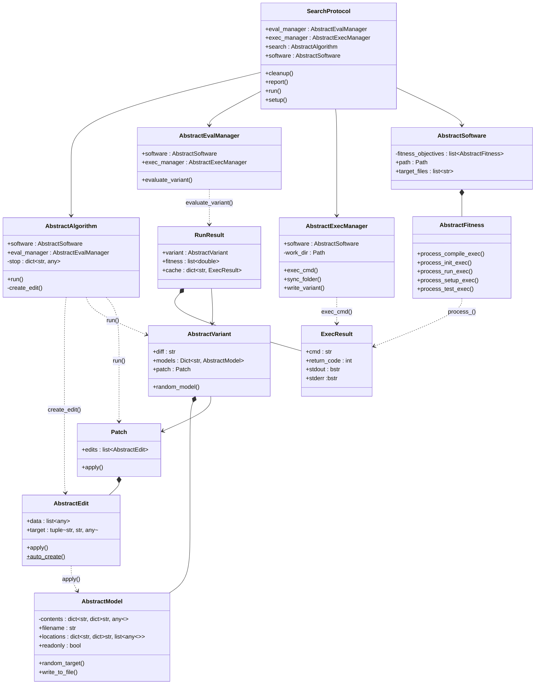
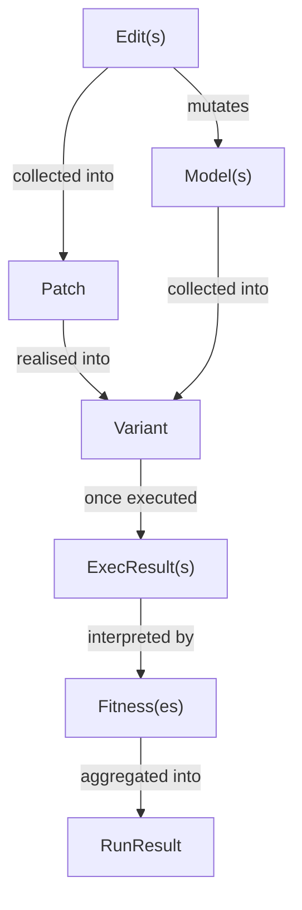

# Simplified Architecture

```mermaid
classDiagram
    class AbstractAlgorithm {
        +software : AbstractSoftware
        +eval_manager : AbstractEvalManager
        -stop : dict~str, any~
        +run()
        -create_edit()
    }

    class AbstractEdit {
        +data : list~any~
        +target : tuple~str, str, any~
        +apply()
        +auto_create()$
    }

    class AbstractEvalManager {
        +software : AbstractSoftware
        +exec_manager : AbstractExecManager
        +evaluate_variant()
    }

    class AbstractExecManager {
        +software : AbstractSoftware
        +exec_cmd()
        +sync_folder()
        -work_dir : Path
        +write_variant()
    }

    class AbstractFitness {
        +process_compile_exec()
        +process_init_exec()
        +process_run_exec()
        +process_setup_exec()
        +process_test_exec()
    }

    class AbstractModel {
        -contents : dict~str, dict~str, any~~
        +filename : str
        +locations : dict~str, dict~str, list~any~~~
        +readonly : bool
        +random_target()
        +write_to_file()
    }

    class AbstractSoftware {
        -fitness_objectives : list~AbstractFitness~
        +path : Path
        +target_files : list~str~
    }

    class AbstractVariant {
        +diff : str
        +models : Dict~str, AbstractModel~
        +patch : Patch
        +random_model()
    }

    class ExecResult {
        +cmd : str
        +return_code : int
        +stdout : bstr
        +stderr :bstr
    }

    class Patch {
        +edits : list~AbstractEdit~
        +apply()
    }

    class RunResult {
        +variant : AbstractVariant
        +fitness : list~double~
        +cache : dict~str, ExecResult~
    }

    class SearchProtocol {
        +eval_manager : AbstractEvalManager
        +exec_manager : AbstractExecManager
        +search : AbstractAlgorithm
        +software : AbstractSoftware
        +cleanup()
        +report()
        +run()
        +setup()
    }

    %% inheritance <|--

    %% compositions *--
    AbstractSoftware *-- AbstractFitness
    AbstractVariant *-- AbstractModel
    Patch *-- AbstractEdit
    RunResult *-- ExecResult

    %% aggregations o--

    %% associations -->
    AbstractVariant --> Patch
    RunResult --> AbstractVariant
    SearchProtocol --> AbstractAlgorithm
    SearchProtocol --> AbstractEvalManager
    SearchProtocol --> AbstractExecManager
    SearchProtocol --> AbstractSoftware

    %% links -- / ..

    %% dependencies ..>
    AbstractAlgorithm ..> AbstractEdit : create_edit()
    AbstractAlgorithm ..> AbstractVariant : run()
    AbstractAlgorithm ..> Patch : run()
    %%AbstractEvalManager ..> AbstractVariant : evaluate_variant()
    AbstractEvalManager ..> RunResult : evaluate_variant()
    AbstractExecManager ..> ExecResult : exec_cmd()
    %%SearchProtocol ..> AbstractAlgorithm : run()
    AbstractEdit ..> AbstractModel : apply()
    AbstractFitness ..> ExecResult : process_()

    %% realization ..|>
```

# Search Evaluation Pipeline

```mermaid
flowchart
  Edit["Edit(s)"]
  Model["Model(s)"]
  ExecResult["ExecResult(s)"]
  Fitness["Fitness(es)"]

  Edit -->|collected into| Patch
  Patch -->|realised into| Variant
  Edit -->|mutates| Model
  Model --->|collected into| Variant
  Variant -->|once executed| ExecResult
  ExecResult -->|interpreted by| Fitness
  Fitness -->|aggregated into| RunResult
```
